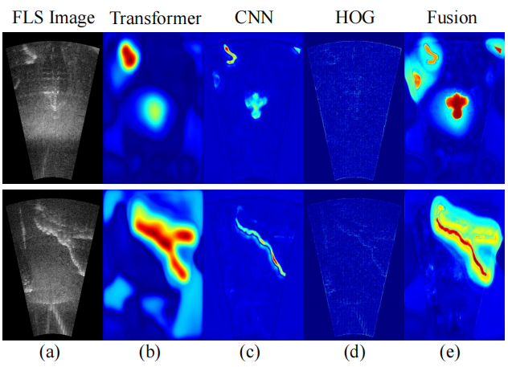
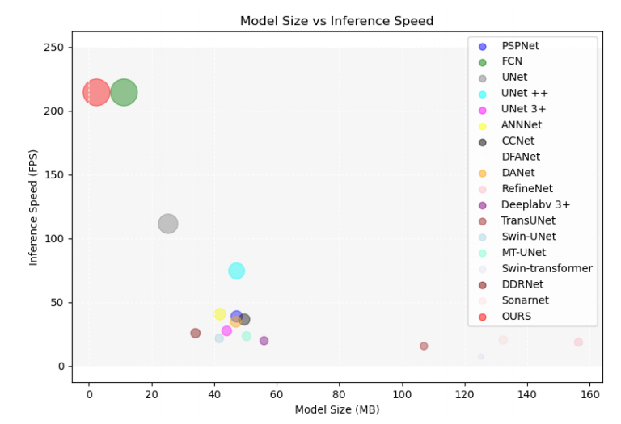
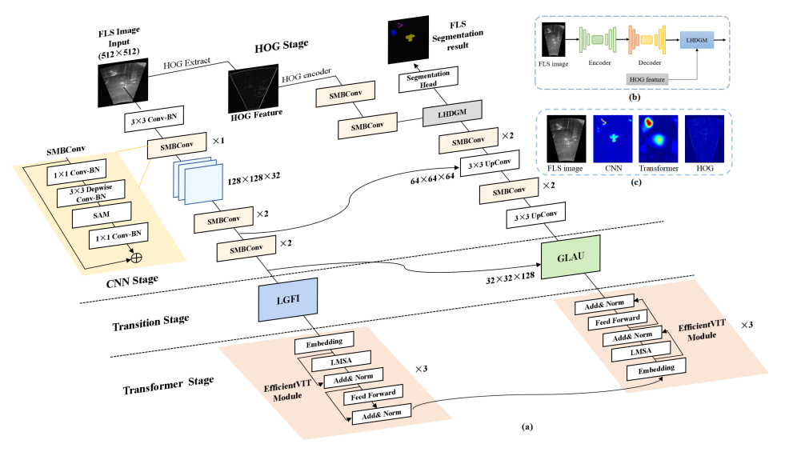
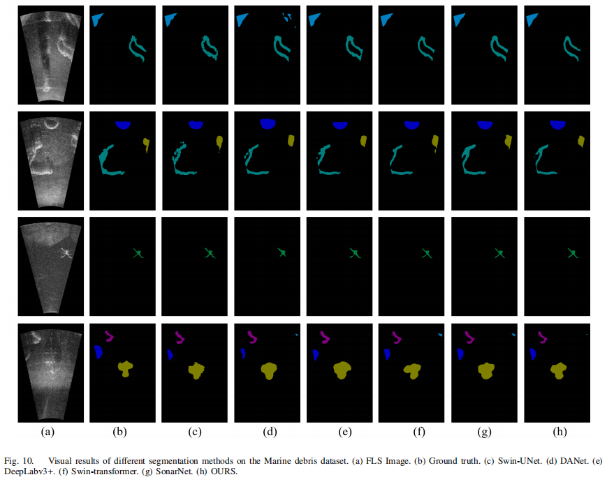

<!--
 * @Author: orchxuhu
 * @Date: 2024-06-10 18:34:52
 * @LastEditors: orchxuhu
 * @LastEditTime: 2024-07-28 15:29:44
 * @Description: 
 * 
 * Copyright ORCA 2024, All Rights Reserved. 
-->
# Efficient SonarNet
Efficient forward-looking sonar iamge segmentation, along with our paper work "Efficient SonarNet: Lightweight CNN Grafted
Vision Transformer Embedding Network for Forward-Looking Sonar Image Segmentation" in IEEE Transactions on Geoscience and Remote Sensing Journal.

<p align="center">

</figure> 
</p>

<p align="center">

</figure> 
</p>

## Abstract

While the intricate underwater environment leads to blurry and faint features of sonar targets, SonarNet has depicted great success due to its high model capabilities and multi-feature fusion mechanism. However, their remarkable performance is accompanied by heavier backbones and larger model sizes to achieve benefits at the cost of increased complexity. The research on fast segmenters deployed on edge devices is urgently inquired. In this paper, we analyze the current best-performing sonar image segmentation network named SonarNet. Based on the analysis, we propose a lightweight local feature grafted vision transformer embedding network for forward-looking sonar images called EsonarNet, which promotes a priority balance between efficiency and accuracy. EsonarNet is based on a hybrid local-global feature grafting architecture and comprises four modules. (1) A lightweight sonar semantic segmentation model based on hybrid CNN-Transformer-HOG fusion encoding and decoding, while preserving high efficiency applied to hardware resources. (2) Lightweight encoder units are employed in our EsonarNet, including a designed spatial mobile convolution (SMBConv) and efficient vision transformer module. (3) Serving as a transitional liaison between the CNN encoder and transformer encoder, the LGFI module focuses on dispersing local semantic information to facilitate long-distance computations, and the GLAU module computes correlations through dot products to restore inductive bias. (4) The HOG features are introduced into EsonarNet through the LHDGM module to ensure the coherence and compatibility of the acquired traditional and abstract information with different semantics. Ultimately, experimental results demonstrate that EsonarNet outperforms other methods for FLS image segmentation in efficiency.


<p align="center">

</figure> 
</p>

## Datasets
You need to first download Marine debris dataset [link](https://openaccess.thecvf.com/content/ICCV2021W/OceanVision/html/Singh_The_Marine_Debris_Dataset_for_Forward-Looking_Sonar_Semantic_Segmentation_ICCVW_2021_paper.html)
or Underwater acoustic target detection dataset [link](https://www.nature.com/articles/s41597-022-01854-w) . Then the dataset is put as the data folder as follows:

### Data structure
```
- Segdataset
  - ImageSets
      - test.txt
      - val.txt
      - train.txt
  - JPEGImages
  - SegmentationClass
  - HOGImage
```

## Visualization Samples
<p align="center">

</figure> 
</p>


## Acknowledgement
If you have any question, you could also contact hj@mail.nwpu.edu.cn. We use some codes from [SonarNet](https://ieeexplore.ieee.org/abstract/document/10443635/)[1], [Deeplabv3+](https://github.com/bubbliiiing/deeplabv3-plus-pytorch)[2]. A big thanks to their great work!

[1]"SonarNet: Hybrid CNN-Transformer-HOG Framework and Multifeature Fusion Mechanism for Forward-Looking Sonar Image Segmentation." IEEE Transactions on Geoscience and Remote Sensing 62 (2024): 1-17.

[2] "Encoder-decoder with atrous separable convolution for semantic image segmentation " Proceedings of the European conference on computer vision (ECCV). 2018: 801-818.